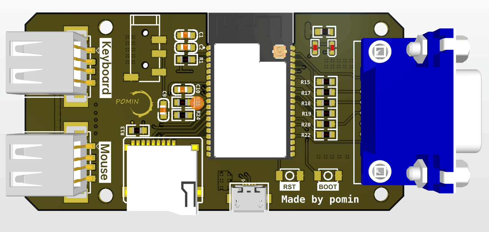
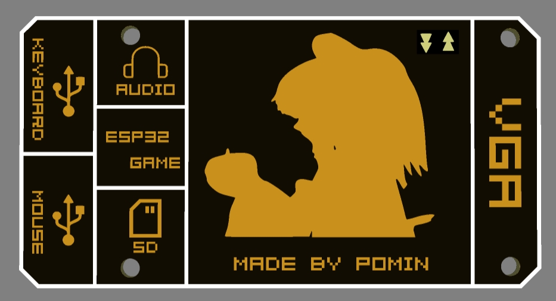
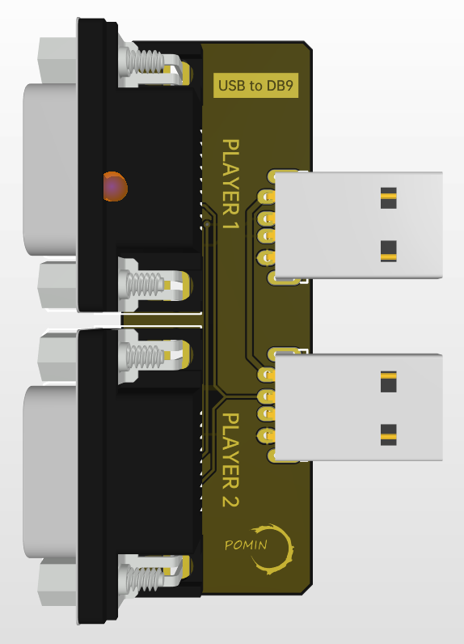
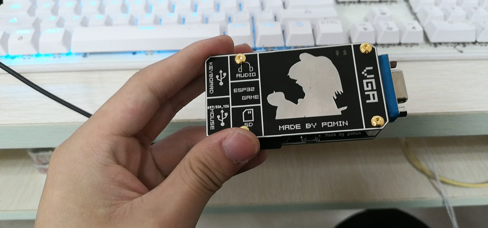
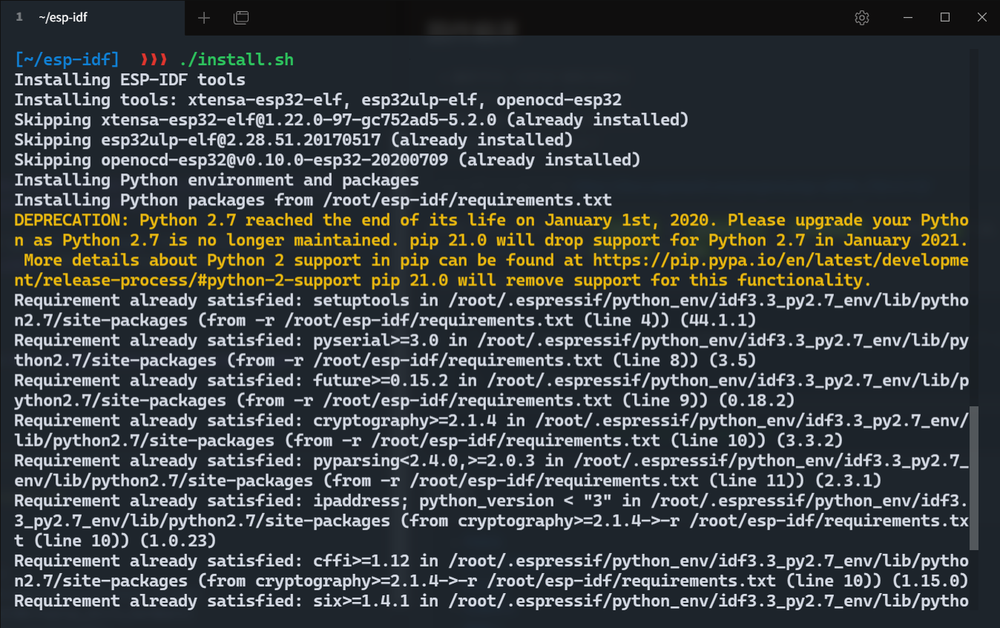
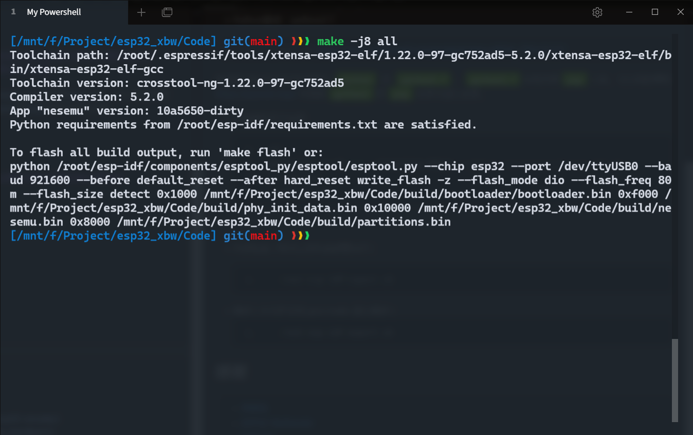
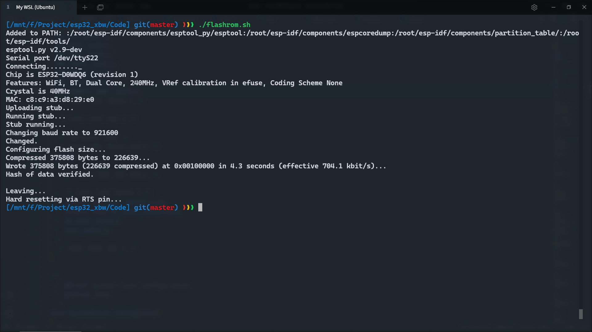
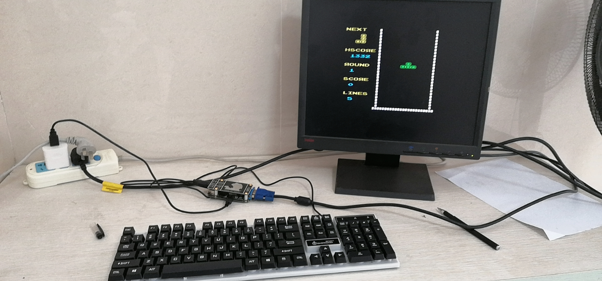
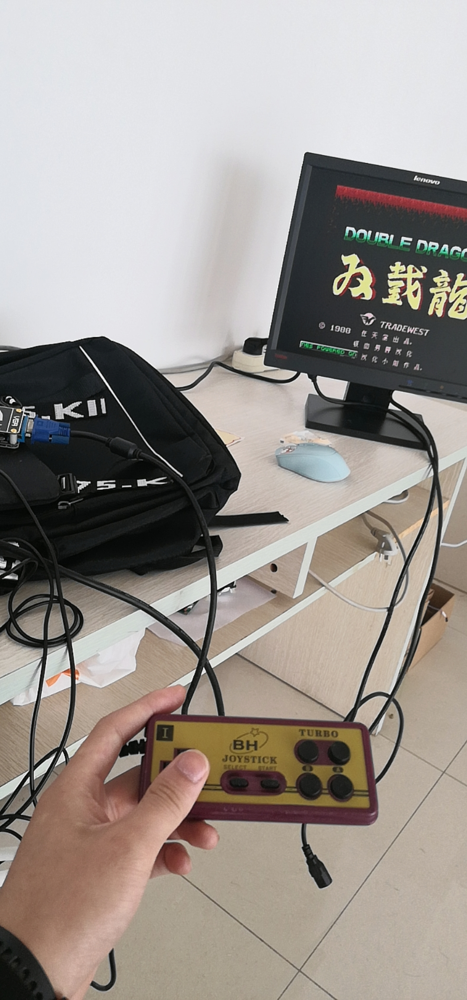

# 一个基于VGA显示器的小霸王复刻

> 本仓库主要克隆自 [https://github.com/eleree/xbw](https://github.com/eleree/xbw)，做了一些修改、对复现的过程进行了一些完善

## 硬件制作

* 因为我是手焊，所以删去了较难焊的 16pin type-c 并把电阻电容换成了 0805 封装。

* 主板
    
* 盖板
    
* 转接板
    
* 实物外观
    

## 固件编译

* 硬件平台：ESP32-WROVER-E
* 软件平台：ESP32-IDF V3.3.5
* 编译环境：Ubuntu18.04 (WSL)
* Python版本：python2.7

> esp-idf3.3.5 官方文档: [https://docs.espressif.com/projects/esp-idf/zh_CN/v3.3.5/](https://docs.espressif.com/projects/esp-idf/zh_CN/v3.3.5/)

使用的 Ubuntu18.04 中默认 `python` 是 `python2.7`，`python2.7`没有自带`pip`工具，可以我的博客 [https://pomin.top/](https://pomin.top/) 中搜索`python2`的`pip`安装，来按照教程进行安装。

* 克隆储存库并安装

```
cd ~
git clone -b v3.3.5 --recursive https://github.com/espressif/esp-idf.git
cd esp-idf
./install.sh
```



* 外部包含 ( 每次启动终端都要执行 )

```bash
. /root/esp-idf/export.sh
```

* 编译 ( 本仓库采用 gnu make 进行编译 )

```bash
# cd 到仓库的 Code 目录
make -j8 all
```



* 烧录 ( 端口号、烧录速率需要自己设置这里是`ttyS22` 也就是 Windows 设备管理器的 `COM22` )

```bash
. ${IDF_PATH}/add_path.sh
esptool.py --chip esp32 --port "/dev/ttyS22" --baud $((230400*4)) write_flash -fs 4MB 0x100000 "build/nesemu.bin"
```



## 演示

* 运行 `arduino` 的 `fabgl` 库的 `VIC20` 例程玩俄罗斯方块
    
* 运行 [秦秦心](https://github.com/eleree/xbw) 开源的基于`idf3.3.5`开发的 nes 游戏机
    

## 感谢以下开源
> * [FABGL](http://www.fabglib.org/)
> * [ESP32-Nofrendo](https://github.com/espressif/esp32-nesemu)
> * [ESPLAY](https://github.com/pebri86/esplay_micro_hardware)
> * [吐槽坑儿](https://space.bilibili.com/31312385)
> * [秦秦心](https://github.com/eleree/xbw)


